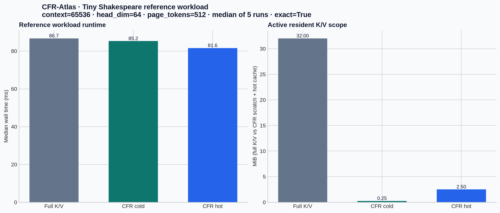

# CFR-Atlas reference-workload benchmark

## Environment and measurement discipline

This report measures the in-repository deterministic reference workload on a public Tiny Shakespeare corpus. The corpus is used only as a reproducible byte-token source; this is **not** an end-to-end language-model benchmark. Each method receives the same context, query, deterministic K/V recipe, page configuration and release build. The reported value is the median of five timed runs, with minimum and maximum retained in the raw CSV. Every CFR timing run is compared with an independently materialized full-K/V attention output; any non-zero output difference aborts the harness before it prints a successful row.

| Environment item | Value |
|---|---|
| Operating system | Ubuntu 24.04.4 LTS, kernel 6.18.38+ |
| CPU | Intel Xeon Processor @ 2.10 GHz; 6 logical CPUs visible |
| Toolchain | rustc 1.75.0; cargo 1.75.0; `--release` |
| Corpus | Tiny Shakespeare, 1,115,394 bytes, SHA-256 `86c4e6aa9db7c042ec79f339dcb96d42b0075e16b8fc2e86bf0ca57e2dc565ed` [1] |
| Context / head / page | 65,536 tokens / 64 dimensions / 512 tokens |
| Hot-cache configuration | 8 MiB budget; `KeepRecent { recent_tokens: 4096 }` |
| Sampling policy | One unmeasured warm-up, then five timed runs; median/min/max reported |

## Main comparison

| Method | Measured work | Median, ms | Min–max, ms | Contexts/s | Active resident K/V | Resident-memory ratio vs full K/V | Exactness |
|---|---|---:|---:|---:|---:|---:|---:|
| `full_kv` | Materialize and consume the full reference K/V stream | 86.659 | 85.254–91.820 | 11.540 | 32.00 MiB | 1.00× | `max_abs_diff = 0` |
| `cfr_cold` | Regenerate every page; no hot admission | 85.231 | 84.203–86.593 | 11.733 | 0.25 MiB | **128.00×** | `max_abs_diff = 0` |
| `cfr_hot` | Bounded `KeepRecent` hot-cache admission | **81.556** | 78.154–83.852 | **12.262** | 2.50 MiB | 12.80× | `max_abs_diff = 0` |



The cold configuration performs 128 cold regenerations per measured context and retains only the maximum scratch-page scope. The hot configuration averages 9 hot-page hits and 119 cold regenerations after warm-up; it uses more bounded resident K/V to recover a modest amount of reference-workload runtime. Both CFR rows pass the harness's per-run exactness gate.

## Interpretation

The result demonstrates the intended **resident-memory versus recomputation** trade-off on the included reference workload. In this environment, cold CFR reduces active resident K/V accounting from 32.00 MiB to 0.25 MiB, while the bounded hot configuration keeps 2.50 MiB active and has the lowest median runtime among the three measured paths.

These figures are not a generic CPU-inference, model-quality, token/s, latency or process-RSS claim. The deterministic backend does not include tokenizer work, transformer blocks, model weights, production matrix kernels, network transport, allocator effects outside the K/V buffers or a real serving loop. Wall time can vary with CPU placement, frequency, memory bandwidth and host load; the raw min/max values are included for that reason. The methodology follows the requirement to define a workload, comparison baseline and repeated measurement, while treating a small benchmark as evidence rather than a universal performance statement. [2]

## Raw artifacts

| Artifact | Purpose |
|---|---|
| [`cfr_atlas_tinyshakespeare_raw.csv`](cfr_atlas_tinyshakespeare_raw.csv) | Direct harness output: all reported raw method rows |
| [`cfr_atlas_tinyshakespeare_summary.csv`](cfr_atlas_tinyshakespeare_summary.csv) | Derived memory and speed ratios used by the chart |
| [`cfr_atlas_tinyshakespeare.png`](cfr_atlas_tinyshakespeare.png) | Generated runtime/resident-memory comparison |
| [`../bench/bench_cfr.rs`](../bench/bench_cfr.rs) | Dependency-free harness and exactness gate |
| [`../bench/plot_results.py`](../bench/plot_results.py) | CSV-to-summary/chart renderer |

## Reproduce

```sh
python3 bench/fetch_tinyshakespeare.py
cargo fmt --all -- --check
cargo clippy --workspace --all-targets -- -D warnings
cargo test --workspace --release

cargo run --release --bin bench-cfr -- \
  --corpus bench/data/tinyshakespeare.txt \
  --context-tokens 65536 \
  --head-dim 64 \
  --page-tokens 512 \
  --hot-cache-bytes 8388608 \
  --recent-tokens 4096 \
  --runs 5 | tee results/cfr_atlas_tinyshakespeare_raw.csv

python3 bench/plot_results.py results/cfr_atlas_tinyshakespeare_raw.csv \
  --output results/cfr_atlas_tinyshakespeare.png \
  --summary results/cfr_atlas_tinyshakespeare_summary.csv
```

## References

[1] [Tiny Shakespeare source — karpathy/char-rnn](https://raw.githubusercontent.com/karpathy/char-rnn/master/data/tinyshakespeare/input.txt).

[2] [The Rust Performance Book — Benchmarking](https://nnethercote.github.io/perf-book/benchmarking.html).
