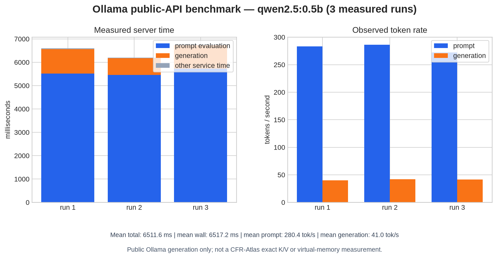

# Real Ollama public-API benchmark: `qwen2.5:0.5b`

> **Scope:** This report measures a real local Ollama server executing a real `qwen2.5:0.5b` model through documented non-streaming generation. It verifies the `cfr-atlas-ollama` public integration path, but it is **not** a CFR-Atlas exact-attention or virtual-K/V measurement.

The benchmark ran on 2026-08-21 against Ollama `0.32.15`, bound to `127.0.0.1:11434`. The model was downloaded by Ollama, not mocked. The server exposed `qwen2.5:0.5b` with digest `a8b0c51577010a279d933d14c2a8ab4b268079d44c5c8830c0a93900f1827c67`, a 397,821,319-byte local artifact, `qwen2` family, GGUF format and `Q4_K_M` quantization. The saved [`ollama_public_api_model_record.json`](ollama_public_api_model_record.json) retains the raw `/api/tags` and `/api/show` replies that produced this fingerprint. The tags and show surfaces are documented by Ollama as model-discovery operations. [1] [2]

## Result at a glance

| Measured quantity | Mean of 3 runs | Interpretation |
|---|---:|---|
| End-to-end client wall time | **6,517.2 ms** | Local client-to-server elapsed time after warm-up |
| Ollama-reported total time | **6,511.6 ms** | Server-side total duration for the request |
| Prompt evaluation | **5,566.1 ms** | Evaluation of the real 1,560-token prompt |
| Prompt throughput | **280.4 tokens/s** | Observed prefill rate on this CPU-only environment |
| Generation time | **919.9 ms** | Decode time for the returned response |
| Generation throughput | **41.0 tokens/s** | Observed decode rate; not an end-to-end serving SLA |
| Model-load duration | **0.9 ms** | The warm-up was excluded and the model was intentionally kept resident |



The individual measured runs are retained in [`ollama_public_api_raw.csv`](ollama_public_api_raw.csv). They produced 42, 30 and 41 generated tokens respectively. The chart is rendered from that CSV by [`bench/plot_ollama_public_api.py`](../../bench/plot_ollama_public_api.py); it is not hand-authored.

## Environment and workload

| Dimension | Recorded value |
|---|---|
| Ollama server | `0.32.15`, local `http://127.0.0.1:11434` |
| Compute path | CPU; Ollama server reported no GPU/VRAM |
| Processor | Intel(R) Xeon(R) Processor @ 2.10GHz |
| Logical CPUs | 6 |
| Memory available before run | 20 GiB |
| Operating system | Linux `6.18.38+`, x86_64 |
| Model | `qwen2.5:0.5b`, 494.03M parameters, GGUF `Q4_K_M` |
| Model topology from `/api/show` | 24 blocks, 14 query heads, 2 K/V heads, 896 embedding width, 32,768-token advertised context |
| Prompt policy | 1,560 observed tokens; `num_ctx=2048`, `num_predict=64`, `temperature=0`, `seed=42` |
| Sampling protocol | 1 warm-up excluded; 3 measured non-streaming requests |

Every request begins with a distinct `benchmark-case` marker before the same long context. This prevents reuse of a previous **full** prompt prefix, which would otherwise make prefill time unrepresentative. The benchmark uses `POST /api/generate` with `stream: false`; the API documents non-streaming generation and reports the duration and token-count fields used by the harness. [3]

## CFR-Atlas interpretation

| Question | Observed result | Correct conclusion |
|---|---|---|
| Does a real model execute through Ollama? | Yes. The local server loaded `qwen2.5:0.5b`, completed warm-up and all three measured generation requests. | The public Ollama generation path is real and reproducibly measured. |
| Does the Rust integration work against the real service? | Yes. `ollama_public_api` successfully listed models, read `/api/show`, generated text, and verified the public exact-K/V gate. | `cfr-atlas-ollama` exercises the actual service, not only mock transport tests. |
| Is this an exact CFR virtual-K/V benchmark? | No. `ExactKvAccess::UnavailableThroughPublicApi` remains active. | No CFR residency, cold-page regeneration, attention equality, or logit-conformance number may be inferred from this result. |
| Is an f32 K/V-size estimate available? | Arithmetic from the discovered topology and observed context gives **36.562 MiB** for `2 × 24 layers × 2 K/V heads × 1,560 tokens × 64 dimensions × 4 bytes`. | This is a transparent theoretical f32 tensor-size calculation, not an observed Ollama cache allocation or a CFR measurement. |

The `/api/show` reply includes model metadata and tensor **descriptions**, while the public generation API returns generated text and aggregate timing/token counts. Neither public response supplies per-layer historical K/V values, token-position replay, or a `KvRegenerator` implementation. The integration therefore fails closed by design, as required by [`docs/OLLAMA.md`](../../docs/OLLAMA.md) and [`docs/ADAPTERS.md`](../../docs/ADAPTERS.md). [2] [3]

## Live integration findings

The real endpoint test also identified and corrected two transport issues before the final measurement was recorded. The standard local client now attempts all addresses resolved for `localhost`, so an unavailable IPv6 loopback result does not prevent a successful IPv4 local connection. It also decodes HTTP chunked responses, which this Ollama version uses for the large `/api/show` payload. Both fixes are protected by strict linting and a chunked-response regression test; the client now records the model digest by correlating `/api/show` with `/api/tags` when show does not return it directly.

## Reproduce

Run a local Ollama service, pull the stated model, then execute the scripts from the CFR-Atlas repository root. Ollama documents the local API base URL, model listing, model inspection and non-streaming generation endpoints. [1] [2] [3]

```sh
ollama pull qwen2.5:0.5b
ollama serve

python3 bench/bench_ollama_public_api.py \
  --base-url http://127.0.0.1:11434 \
  --model qwen2.5:0.5b \
  --runs 3 \
  --output-dir results/ollama_qwen2_5_0_5b_public_api
python3 bench/plot_ollama_public_api.py results/ollama_qwen2_5_0_5b_public_api

OLLAMA_MODEL=qwen2.5:0.5b \
  cargo run -p cfr-atlas-ollama --example ollama_public_api
```

The harness writes a raw CSV, aggregate JSON summary and raw model-discovery JSON. It excludes a single warm-up from aggregates, but keeps the model resident for the measured requests. The benchmark intentionally uses one machine and three samples; it is suitable as a regression and integration baseline, not as a universal model comparison.

## References

[1]: https://docs.ollama.com/api "Ollama API introduction and local base URL"
[2]: https://docs.ollama.com/api/tags "Ollama API: list models"
[3]: https://docs.ollama.com/api/generate "Ollama API: generate a response"
[4]: https://docs.ollama.com/api/embed "Ollama API: generate embeddings"
