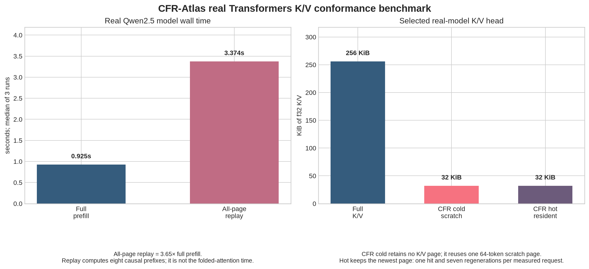

# Real Transformers exactness benchmark: Qwen2.5-0.5B

> **Scope:** This is the first real-model CFR-Atlas conformance result. A pinned Hugging Face `Qwen/Qwen2.5-0.5B` revision runs on public Tiny Shakespeare tokens, independently replays every causal K/V page, and passes those real rows to the public Rust `CfrAtlas` contract. It is not yet a modified end-to-end Qwen runtime that routes every layer/head through CFR during generation.

The experiment uses Qwen2.5-0.5B revision `060db6499f32faf8b98477b0a26969ef7d8b9987`, with 494,032,768 parameters, 24 decoder layers, 14 query heads, 2 K/V heads and a 64-element head dimension. It uses the first 512 tokens from the repository's downloaded Tiny Shakespeare corpus, `f32` CPU eager attention, a 64-token page, one selected execution target `(layer=0, K/V head=0, query head=0)`, and six CPU threads. The model's cache interface is layer-wise K/V tensor state, which is the controlled runtime boundary required for this test. [1] [2]

## Result at a glance

| Evidence | Observed result | Interpretation |
|---|---:|---|
| All-layer K page replay difference | `3.0517578e-05` | Below the declared `5e-03` f32 conformance bound |
| All-layer V page replay difference | `2.8371811e-05` | Below the declared `5e-03` f32 conformance bound |
| Page-replay final-logit difference | **`0.0`** | Replaying all eight causal prefix pages preserved the final-model logit exactly in this run |
| Incremental-cache final-logit difference | `3.5762787e-05` | Below the same f32 bound |
| CFR output vs direct f32 attention | `4.18e-07` | The Rust folded reducer consumed the real exported K/V rows within low f32 rounding error |
| CFR cold resident K/V | **0 KiB** | Eight pages are regenerated; one 32 KiB scratch page is reused |
| CFR hot resident K/V | **32 KiB** | The newest 64-token page is retained; one hot hit and seven cold regenerations per measured request |



The raw model measurements are [`transformers_qwen2_5_0_5b_transformers_raw.csv`](transformers_qwen2_5_0_5b_transformers_raw.csv); the raw Rust bridge samples are [`transformers_qwen2_5_0_5b_cfr_raw.csv`](transformers_qwen2_5_0_5b_cfr_raw.csv); and every derived number is recorded in [`transformers_qwen2_5_0_5b_cfr_summary.json`](transformers_qwen2_5_0_5b_cfr_summary.json). The chart is generated only from these files by [`bench/plot_transformers_cfr.py`](../bench/plot_transformers_cfr.py).

## What was proven

The standard full-Qwen forward materializes a 12 MiB f32 K/V cache for all 24 layers and two K/V heads at this 512-token context. The tested selected head itself occupies 256 KiB. CFR-Atlas performs one attention call for that selected real K/V head without keeping any page in the cold configuration: it reuses exactly one 64-token f32 K/V scratch buffer of 32 KiB. The bounded-hot configuration retains exactly the newest page, also 32 KiB. Thus, for the **selected tested head**, both active cold scratch and hot resident K/V are **8× smaller** than its full 512-token K/V state.

The exporter validates the important model-side prerequisite before the Rust benchmark begins. For each 64-token page, it executes a fresh model forward over the causal prefix ending at that page, extracts each layer's K/V rows for only that page, and compares them with the conventional 512-token full forward. The final-page logits are also compared. The small non-zero all-layer K/V differences arise from `f32` GEMM/reduction scheduling for different batch shapes; the retained tolerance is explicit in the manifest rather than hidden. The selected target K/V page values happened to match bitwise in the recorded run, while the all-layer and incremental checks passed the stated `5e-03` bound.

## Performance result and its limit

| Operation | Median | Samples | What the time includes |
|---|---:|---:|---|
| Conventional Qwen full prefill | **0.925 s** | 3 | One real 512-token model forward, including all layers |
| Independent all-page replay | **3.374 s** | 3 | Eight real causal prefix forwards used to recreate every page |
| CFR cold folded attention | **0.172 ms** | 5 | Rust page consumption over already exported in-memory values |
| CFR newest-page-hot folded attention | **0.161 ms** | 5 | One real K/V page hit plus seven in-memory regenerator calls |

All-page replay is **3.65×** the conventional prefill median in this controlled CPU run. That is expected: this first adapter deliberately recomputes a causal prefix for each page to establish the conformance contract. It proves the correctness and bounded-residency path but **does not** claim an end-to-end Qwen latency improvement. The sub-millisecond CFR times are likewise not full-model serving numbers: model weights and page recomputation are outside the Rust folding loop.

> The defensible conclusion is that CFR-Atlas now has a real-model K/V and final-logit conformance baseline, with true page-replay cost exposed. The next production task is to place the same page regeneration behind a native runtime execution boundary, so the model can regenerate only the needed page rather than replaying full prefixes.

## Reproduce

The exporter downloads the model through Hugging Face, uses the local Tiny Shakespeare corpus already fetched by `bench/fetch_tinyshakespeare.py`, and writes large transient tensor files to ignored `bench/data/`. The published files are the raw measurements and derived report, not model weights or tensor dumps.

```sh
python3 bench/fetch_tinyshakespeare.py
sudo pip3 install torch==2.5.1 --index-url https://download.pytorch.org/whl/cpu
sudo pip3 install transformers==4.48.3 safetensors==0.5.2 huggingface-hub==0.27.1

python3 bench/export_transformers_qwen_kv.py \
  --model Qwen/Qwen2.5-0.5B \
  --context-tokens 512 \
  --page-tokens 64 \
  --runs 3 \
  --threads 6 \
  --atol 5e-3

cargo run --release --bin bench-transformers-cfr -- \
  bench/data/transformers_qwen2_5_0_5b \
  | tee results/transformers_qwen2_5_0_5b_cfr_raw.csv
cp bench/data/transformers_qwen2_5_0_5b/timing_raw.csv \
  results/transformers_qwen2_5_0_5b_transformers_raw.csv

python3 bench/plot_transformers_cfr.py \
  --cfr-raw results/transformers_qwen2_5_0_5b_cfr_raw.csv \
  --transformers-raw results/transformers_qwen2_5_0_5b_transformers_raw.csv \
  --manifest bench/data/transformers_qwen2_5_0_5b/manifest.json \
  --summary results/transformers_qwen2_5_0_5b_cfr_summary.json \
  --chart results/transformers_qwen2_5_0_5b_cfr.png
```

## Next validation gate

This experiment should be extended in two directions before a full end-to-end claim. First, repeat the exporter at 4,096 and 16,384 tokens, across every K/V head/layer target and a fixed model revision. Second, implement a native runtime sidecar that has the same token, position, RoPE, GQA and storage-dtype contract but regenerates pages without the present repeated prefix forwards. Only then may full-model latency and whole-model resident-memory figures be reported as CFR-Atlas runtime results.

## References

[1]: https://huggingface.co/docs/transformers/cache_explanation "Hugging Face Transformers: caching"
[2]: https://huggingface.co/docs/transformers/en/kv_cache "Hugging Face Transformers: KV cache strategies"
[3]: https://huggingface.co/Qwen/Qwen2.5-0.5B "Qwen2.5-0.5B model card"
